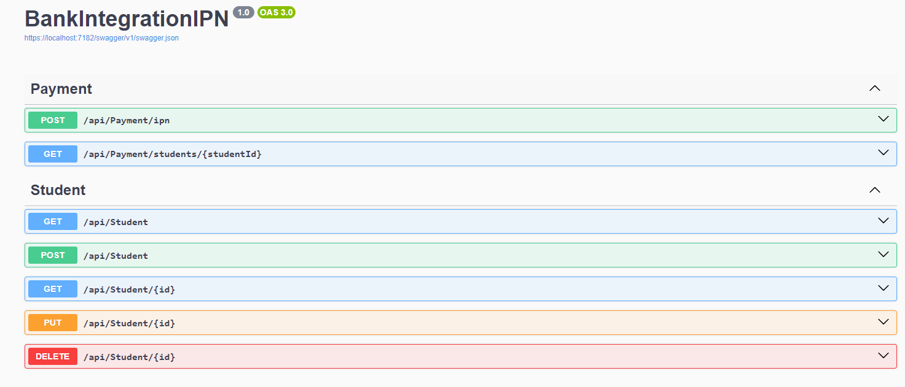
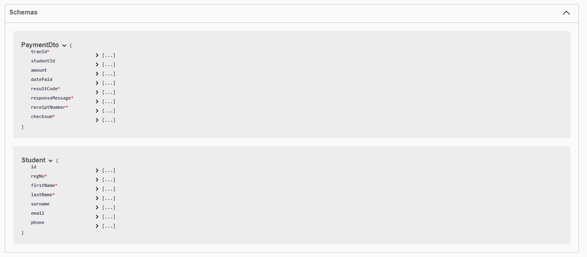

# Instant Payment Notification (IPN) Service 🚀

**BankIntegrationIPN** is a web-based service designed to integrate and process payment notifications from a payment service. 
The service simulates payment integration between a school and a bank. The bank provides a payment gateway, process payments
and sends a response to the school via a call-back API. The school, upon receiving a callback from the bank, it validates checksums
to verify that this response has not been compromised. If the response is verified, the school  stores that information
to their database, updating student's payment record accordingly.


## Design Overview 🧩

- [Controller Layer](./BankIntegrationIPN/Controllers) - Exposes API endpoints to receive IPN requests and process payments.
- [Data Layer](./BankIntegrationIPN/Data) - Manages the database context and handles all interactions with the SQL Server database using Entity Framework Core.
- [Service Layer](./BankIntegrationIPN/Services) - Contains the business logic, and the checksum validation.
- [Configuration Layer](./BankIntegrationIPN/Controllers) - Handles application settings and configurations (e.g., secret keys for checksum validation).


## Tools and Technologies 🛠️

- **Dot Net Core 8.0**: Runtime or SDK.
- **SQL Server**: Service Database.
- **Visual Studio 2022**: IDE.
- **Postman or Curl**: Testing API endpoints.
- **HMAC-SHA256**: Checksum generation and validation.

## Getting Started 🛠️

1. **Clone the repository**

   ```bash
   git clone https://github.com/JamesKibathi/BankIntegrationIPN
   ```

2. **Add Db and other configuration**
   
    We will need to configure a SecretKey in the appsettings.json file. Add a random secret key (16 chars preferred)
    in the PaymentSettings section. THIS IS A MUST

4. **Open the project with Visual Studio or Visual Code Studio**

5. **Search for package manager console to update db and run migrations**
   ```
   # Run migrations

   Update-Database
   ```

6. **Build and run the project to start**
   

8. **Making Requests**
   
   
   After all the services are up navigate to `localhost:5000/swagger/index.html`. 
   SwaggerUI is used for the gateway service documentation with request and response examples, here you can start interacting with the system.

   
   
   
   
     

## Assumptions
<ul>
    <li> The bank bank has already processed the payment and the school only expects a callback.</li>
    <li> Both the school and the bank already have a secret key that they use to verify payments</li>
</ul>
